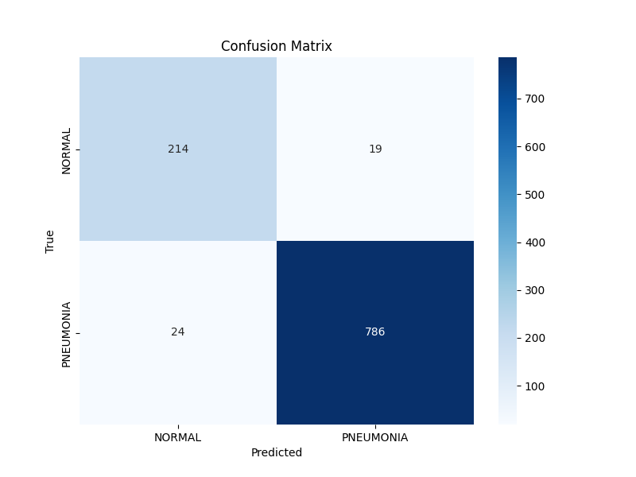
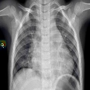

# Pneumonia Detection from Chest X-Rays 🫁

A Convolutional Neural Network (CNN) trained to classify Pneumonia vs. Normal chest X-rays. This project achieves **96% accuracy**, outperforming standard baselines, and includes **Grad-CAM interpretability** to visualize the model's decision-making process.

## 📊 Performance Results
Through data augmentation and regularization techniques (Dropout), we successfully eliminated overfitting and achieved high performance metrics across the board.

- **Accuracy:** 96%
- **Precision (Pneumonia):** 98%
- **Recall (Sensitivity):** 97%
- **F1-Score:** 0.96

### Training Dynamics
The training plots below demonstrate stable learning with validation accuracy closely tracking training accuracy, indicating good generalization.

*Figure 1: Training and validation accuracy/loss showing converged model.*

### Confusion Matrix
The model shows exceptionally low false negatives (missed cases), which is critical for medical screening diagnostic tools.

*Figure 2: Confusion Matrix showing 786 correctly identified Pneumonia cases.*

## 🧠 Explainability (Grad-CAM)
We implemented **Grad-CAM** (Gradient-weighted Class Activation Mapping) to provide weakly supervised localization. This verifies that the model is learning to identify lung texture anomalies and boundaries associated with pneumonia, rather than relying on background artifacts or tags.

*Figure 3: Grad-CAM heatmap superimposed on a chest X-ray. The red/yellow regions indicate where the model is focusing its attention to make the "Pneumonia" prediction.*

## 🚀 How to Run
1. Clone the repository.
2. Install dependencies: `pip install -r requirements.txt` (Note: Requires TensorFlow and OpenCV).
3. Run training: `python3 train_improved.py`
4. Run visualization: `python3 explainability.py`

## 📂 Project Structure
- `train_improved.py`: The main CNN training script with Data Augmentation & Dropout optimized for this dataset.
- `explainability.py`: Script to generate Grad-CAM heatmaps for model interpretability.
- `saved_models/`: Contains the trained `.keras` model file.
- `results/`: Contains output visualizations (plots, confusion matrix, heatmaps).